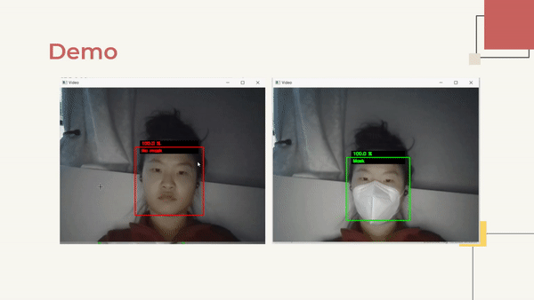

# Face Mask Detector 

The training dataset that's split into **no mask** and **mask** is found here: https://github.com/balajisrinivas/Face-Mask-Detection/tree/master/dataset

### Project Description

---

This face mask detector can be tested using your computer's webcam. The model generated by the VGG16 CNN architecture can give you real time feedback to whether or not you are wearing a mask through the OpenCV powered camera.

---

  

